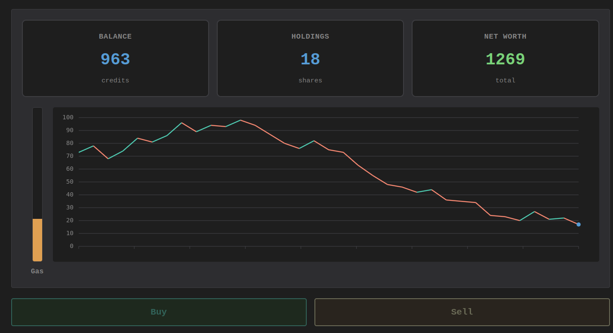
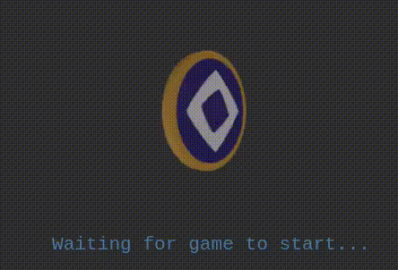

# Monomarket

Hackathon project to create a gambling market that runs on Monad.

The gambling does not use actual tokens/balance, but rather a made up price.

The market is a smart contract (contract/src/StockMarket.sol)

The frontend creates a wallet and stores the private key on local storage (very safe, don't worry). The buy/sell/register TXs are created and signed on the client, and forwarded via websocket to the server, which just broadcasts them onto the network.

When a client connects to the server, the server acts as a faucet and funds the user with 0.5MON.

Also, there's a 3d coin with the monad logo that is used as a spinner:

